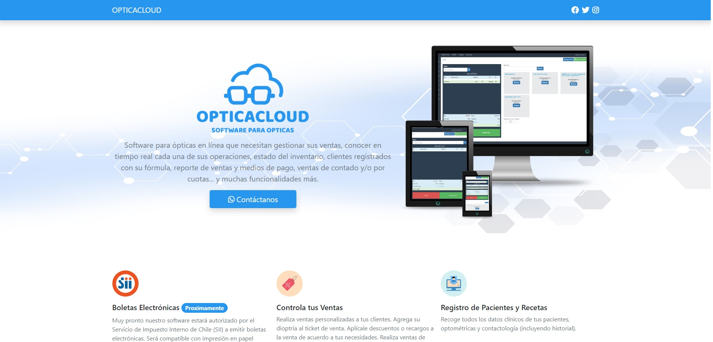

# OPTICACLOUD

## Descripción general

Página web informativa acerca de un software administrativo para Ópticas.

### Las principales herramientas y tecnologías utilizadas incluyeron:

- HTML5: Se utilizó HTML5 para crear la estructura sólida de la página, facilitando la presentación de información de manera organizada y accesible.
- CSS: Se implementó CSS para dar vida a la interfaz, personalizando la apariencia de la página y garantizando una experiencia atractiva. 
- Bootstrap: Se integró Bootstrap para lograr un diseño receptivo y coherente en toda la página, lo que permitió que fuera accesible desde dispositivos móviles y de escritorio sin problemas. 
- JQuery: La librería JQuery permitió realizar algunas operaciones aritméticas en la sección de precios.

### Visita el sitio web:

- [opticacloud.github.io.git](https://roraima1986.github.io/opticacloud.github.io.git/)